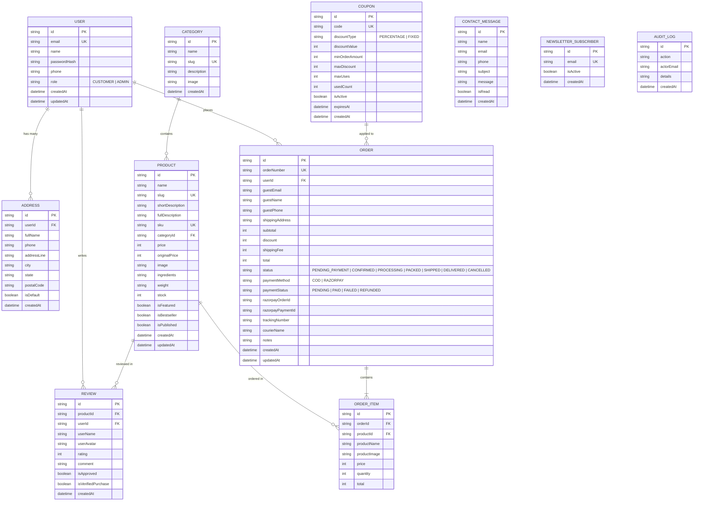

# Entity Relationship Diagram — Zezty Pickles

This document outlines the database entities, constraints, and relationships powering the Zezty Pickles e-commerce platform via Prisma ORM and PostgreSQL / SQLite.

## Modeling Rules & Constraints
- **Money Values**: Handled in integer INR Rupees or Paise to prevent IEEE 754 floating point arithmetic issues.
- **Snapshot Pricing**: `OrderItem` stores the product name, image, and price at the time of purchase so historical receipts are immutable even when catalog prices change.
- **Auditing**: Administrative stock changes, order status updates, and product creations write non-sensitive metadata entries to `AuditLog`.
