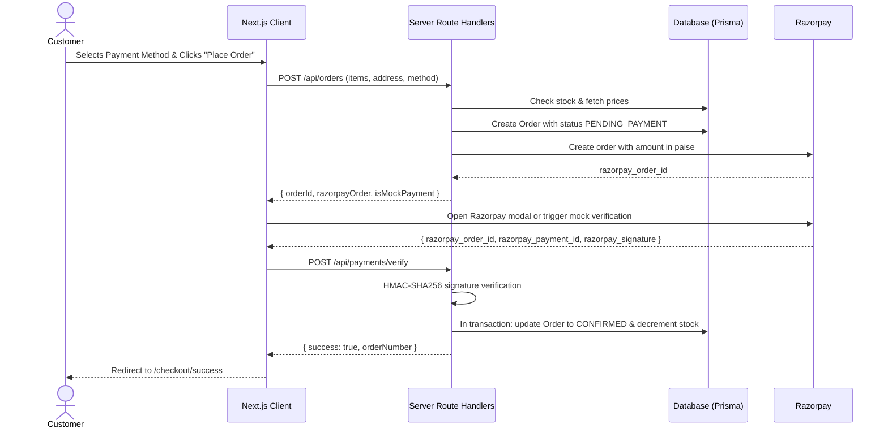

# Payment Integration & Lifecycle — Zezty Pickles

## 1. Sequence Diagram

## 2. Mock vs Live Mode
- When `RAZORPAY_KEY_ID` or `RAZORPAY_KEY_SECRET` contain `mock` or are blank, the payment adapter activates **Local Mock Mode**.
- In mock mode, developers can test checkout end-to-end without real financial credentials.
- When live Razorpay test or production keys (`rzp_test_...` / `rzp_live_...`) are provided, the system executes real API order creation and cryptographic signature checks.
