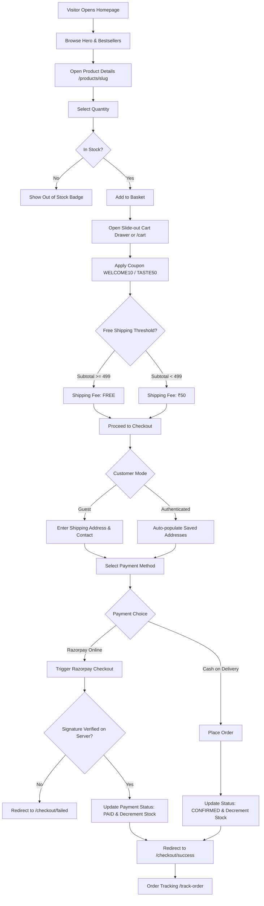
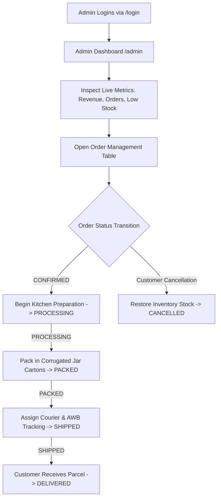

# Application User Journeys and Workflows — Zezty Pickles

## 1. End-to-End Customer Purchase Journey

```mermaid
flowchart TD
    A[Visitor Opens Homepage] --> B[Browse Hero & Bestsellers]
    B --> C[Open Product Details /products/slug]
    C --> D[Select Quantity]
    D --> E{In Stock?}
    E -- No --> F[Show Out of Stock Badge]
    E -- Yes --> G[Add to Basket]
    G --> H[Open Slide-out Cart Drawer or /cart]
    H --> I[Apply Coupon WELCOME10 / TASTE50]
    I --> J{Free Shipping Threshold?}
    J -- Subtotal >= 499 --> K[Shipping Fee: FREE]
    J -- Subtotal < 499 --> L[Shipping Fee: ₹50]
    K --> M[Proceed to Checkout]
    L --> M
    M --> N{Customer Mode}
    N -- Guest --> O[Enter Shipping Address & Contact]
    N -- Authenticated --> P[Auto-populate Saved Addresses]
    O --> Q[Select Payment Method]
    P --> Q
    Q --> R{Payment Choice}
    R -- Cash on Delivery --> S[Place Order]
    R -- Razorpay Online --> T[Trigger Razorpay Checkout]
    T --> U{Signature Verified on Server?}
    U -- No --> V[Redirect to /checkout/failed]
    U -- Yes --> W[Update Payment Status: PAID & Decrement Stock]
    S --> X[Update Status: CONFIRMED & Decrement Stock]
    W --> Y[Redirect to /checkout/success]
    X --> Y
    Y --> Z[Order Tracking /track-order]
```

## 2. Administrator Fulfillment Workflow

```mermaid
flowchart TD
    AA[Admin Logins via /login] --> AB[Admin Dashboard /admin]
    AB --> AC[Inspect Live Metrics: Revenue, Orders, Low Stock]
    AC --> AD[Open Order Management Table]
    AD --> AE{Order Status Transition}
    AE -- CONFIRMED --> AF[Begin Kitchen Preparation -> PROCESSING]
    AF -- PROCESSING --> AG[Pack in Corrugated Jar Cartons -> PACKED]
    AG -- PACKED --> AH[Assign Courier & AWB Tracking -> SHIPPED]
    AH -- SHIPPED --> AI[Customer Receives Parcel -> DELIVERED]
    AE -- Customer Cancellation --> AJ[Restore Inventory Stock -> CANCELLED]
```
